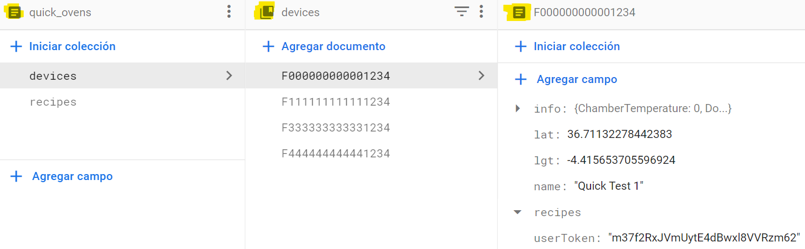

# CRUD Bàsic en c++ per Firestore

### Estructura de dades en Firestore

Firestore utilitza una estructura de dades jeràrquica basada en documents i col·leccions.

Un document és una unitat fonamental de dades a Firestore. Es pot considerar com una entrada en una taula de bases de
dades relacionals, però amb una estructura de dades flexible que pot contenir camps anidats i valors de diferents tipus.
Cada document té una identitat única que el distingeix d'altres documents a la base de dades.

Una col·lecció és un grup de documents. S'utilitza per organitzar els documents i facilitar les consultes a Firestore.
Les col·leccions poden contenir un nombre arbitrari de documents.




### Regles de Firestore

Firestore té un sistema de regles que permeten controlar l'accés i la validació de les dades a la base de dades. Les
regles estan escrites en un llenguatge específic de Firestore, anomenat Firebase Security Rules, i es defineixen per a
cada col·lecció i document.

Hi ha dos tipus de regles:

1. **Regles de seguretat***: controlen qui té accés a la base de dades i quines operacions poden fer. Les regles de
   seguretat es
   configuren a nivell de col·lecció.


2. **Regles de validació**: asseguren que les dades són vàlides abans de ser guardades a la base de dades. Les regles de
   validació es configuren a nivell de document.

#### Regles r/w per autenticació

En aquest exemple, les regles de seguretat de la col·lecció "usuaris" permeten que només els usuaris autenticats puguin
llegir i escriure en aquesta col·lecció.

```
// Create a new document.
service cloud.firestore {
    match /databases/{database}/documents {
      // Només els usuaris autenticats poden llegir/escriure en la col·lecció "usuaris"
      match /usuaris/{usuari} {
        allow read, write: if request.auth != null;
      }
   }
}
```

#### Regles r/w per especificació

En aquest exemple, es permetrà només l'escriptura de documents als usuaris autenticats amb un camp específic en la
request:

```
rules_version = '2';
service cloud.firestore {
  match /databases/{database}/documents {
    match /colleccio/{document} {
      allow read, write: if request.auth != null && request.resource.data.camp == "valor_permes";
    }
  }
}
```

#### Regles r/w per document

En aquest exemple, es permetrà només l'escriptura de documents als usuaris autenticats i només si
el document ja existeix:

```
service cloud.firestore {
  match /databases/{database}/documents {
    match /colleccio/{document} {
      allow read, write: if request.auth != null && 
                         exists(/databases/$(database)/documents/colleccio/$(document));
    }
  }
}
```

### Inicialització del projecte

Per inicialitzar el projecte cal seguir els següents
passos: [Firestore first steps](https://firebase.google.com/docs/cpp/setup?hl=es&platform=ios)

### Comunicació amb Firestore

Per a realitzar la comunicació existeixen dues formes possibles:

1. Descarregar i instal·lar el mòdul de Firebase localment al nostre projecte
2. Utilitzar la REST API proporcionada per firebase per fer les crides remotament.

En aquest projecte s'utilitza l'opció 2.

### Escriure dades:

En l'escriptura de dades el mètode utilitzat és **POST**. Si realitzem un POST a un document/col·leció no existents,
Firestore el crearà per nosaltres. Segueix el següent patró:

```cpp
// Create a new document.
std::string url =
"https://firestore.googleapis.com/v1/projects/mychef-alpha/databases/(default)/documents/users/new_user";
std::string data =
R"({"fields": {"name": {"stringValue": "John Doe"}, "age": {"integerValue": "30"}}})";

curl_easy_setopt(curl, CURLOPT_CUSTOMREQUEST, "POST");
curl_easy_setopt(curl, CURLOPT_URL, url.c_str());
curl_easy_setopt(curl, CURLOPT_POSTFIELDSIZE_LARGE, (curl_off_t)data.size());
curl_easy_setopt(curl, CURLOPT_POSTFIELDS, data.c_str());
CURLcode res = curl_easy_perform(curl);

if (res != CURLE_OK) {
std::cerr << "Failed to create document: " << curl_easy_strerror(res)
<< std::endl;
}
```

### Llegir dades:

En la lectura de de dades el mètode utilitzat és **GET**. Segueix el següent patró:

```cpp
// Read a document.
url =
"https://firestore.googleapis.com/v1/projects/mychef-alpha/databases/(default)/documents/users/new_user";

curl_easy_setopt(curl, CURLOPT_CUSTOMREQUEST, "GET");
curl_easy_setopt(curl, CURLOPT_URL, url.c_str());
std::string response;
curl_easy_setopt(curl, CURLOPT_WRITEDATA, &response);
res = curl_easy_perform(curl);

if (res == CURLE_OK) {
std::cout << "Document contents: " << response << std::endl;
} else {
std::cerr << "Failed to read document: " << curl_easy_strerror(res)
<< std::endl;
}
```

### Actualitzar dades:

Per actualitzar dades podem fer un **POST** a un document/col·lecció ja existent, però sobreescriurà l'arxiu posant a
null
els atributs no especificats.

La forma correcta de realitzar l'actualització és amb el mètode **PATCH**:

```cpp
  // Update a document.
url =
"https://firestore.googleapis.com/v1/projects/mychef-alpha/databases/(default)/documents/users/new_user";
data = R"({"fields": {"age": {"integerValue": "35"}}})";

curl_easy_setopt(curl, CURLOPT_CUSTOMREQUEST, "PATCH");
curl_easy_setopt(curl, CURLOPT_URL, url.c_str());
curl_easy_setopt(curl, CURLOPT_POSTFIELDSIZE_LARGE, (curl_off_t)data.size());
curl_easy_setopt(curl, CURLOPT_POSTFIELDS, data.c_str());
res = curl_easy_perform(curl);

if (res != CURLE_OK) {
std::cerr << "Failed to update document: " << curl_easy_strerror(res)
<< std::endl;
}
```

### Eliminar dades:

Eliminem dades amb el mètode **DELETE**:

```cpp
  // Delete a document.
url =
"https://firestore.googleapis.com/v1/projects/mychef-alpha/databases/(default)/documents/users/new_user";
curl_easy_setopt(curl, CURLOPT_CUSTOMREQUEST, "DELETE");
curl_easy_setopt(curl, CURLOPT_URL, url.c_str());
res = curl_easy_perform(curl);
if (res != CURLE_OK) {
std::cerr << "Failed to delete document: " << curl_easy_strerror(res)
<< std::endl;
}
```